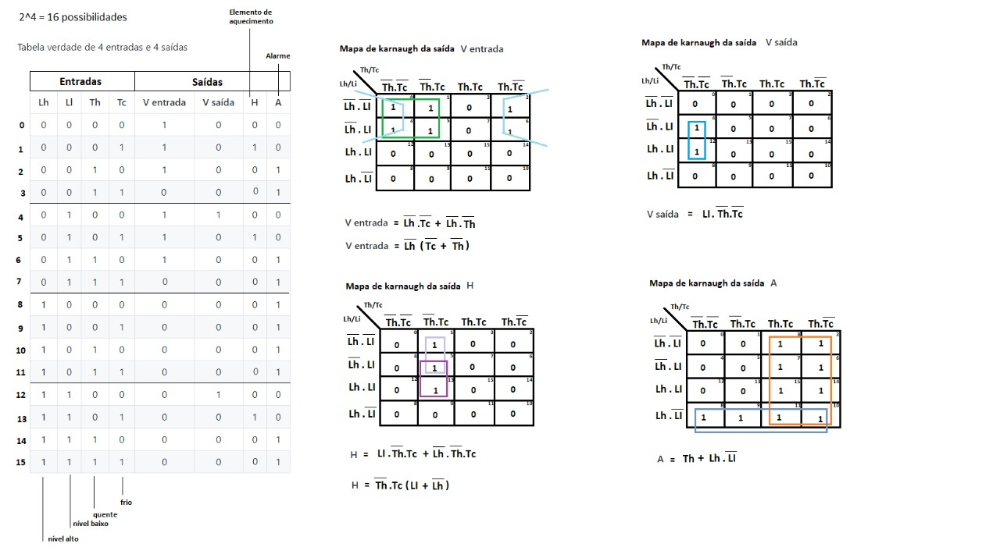
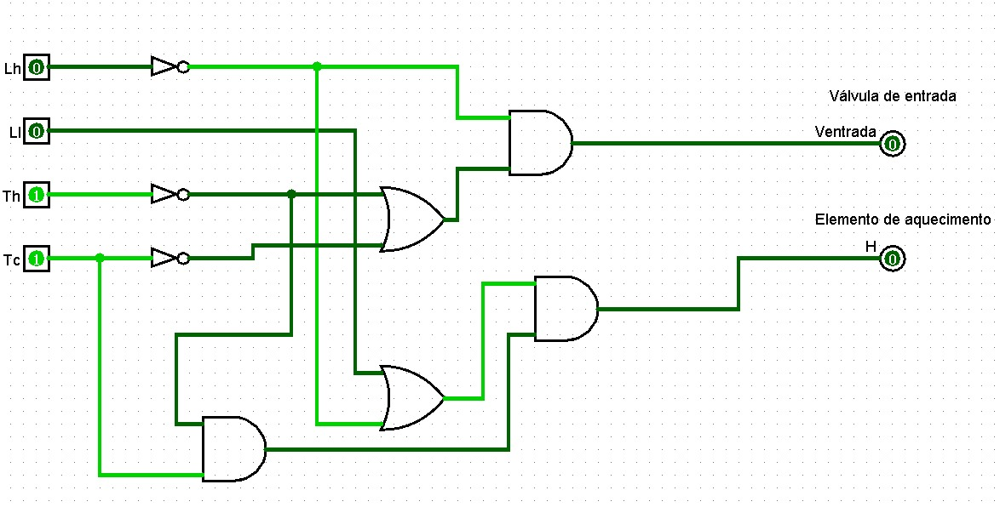
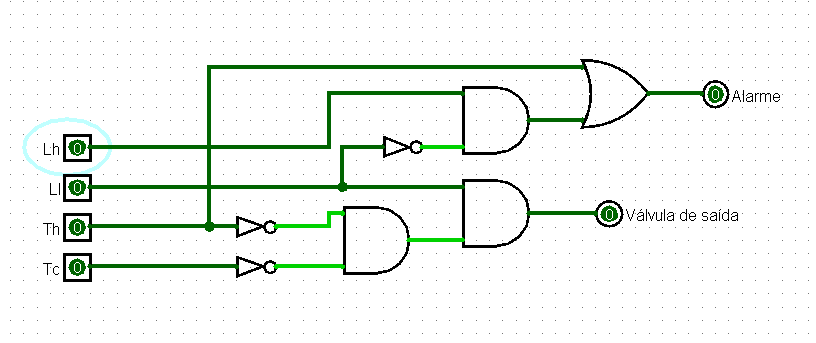

# Prototipação Digital - Atividade 1 GA

Tabela verdade de 4 entradas e 4 saídas

| Lh    | Ll    | Th    | Tc    | V entrada | V saída | H     | A     |
| :---: | :---: | :---: | :---: | :-------: | :-----: | :---: | :---: |
|  0    | 0     | 0     | 0     | 1         | 0       | 0     | 0     |
|  0    | 0     | 0     | 1     | 1         | 0       | 1     | 0     |
|  0    | 0     | 1     | 0     | 1         | 0       | 0     | 1     |
|  0    | 0     | 1     | 1     | 0         | 0       | 0     | 1     |
|  0    | 1     | 0     | 0     | 1         | 1       | 0     | 0     |
|  0    | 1     | 0     | 1     | 1         | 0       | 1     | 0     |
|  0    | 1     | 1     | 0     | 1         | 0       | 0     | 1     |
|  0    | 1     | 1     | 1     | 0         | 0       | 0     | 1     |
|  1    | 0     | 0     | 0     | 0         | 0       | 0     | 1     |
|  1    | 0     | 0     | 1     | 0         | 0       | 0     | 1     |
|  1    | 0     | 1     | 0     | 0         | 0       | 0     | 1     |
|  1    | 0     | 1     | 1     | 0         | 0       | 0     | 1     |
|  1    | 1     | 0     | 0     | 0         | 1       | 0     | 0     |
|  1    | 1     | 0     | 1     | 0         | 0       | 1     | 0     |
|  1    | 1     | 1     | 0     | 0         | 0       | 0     | 1     |
|  1    | 1     | 1     | 1     | 0         | 0       | 0     | 1     |

### Mapas de Karnaugh

### Circuito válvula de entrada e aquecedor

### Circuito válvula de saída e alarme
